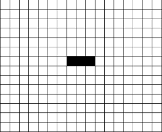

```{r setup, include=FALSE}
knitr::opts_chunk$set(echo = TRUE)
```
# 1. Introduction au jeu de la vie
 
Le texte fut écrit en croissant des information donné par chatGPT, une vidéo youtube [@ego_jeu_2024] et wikipédia [@noauthor_jeu_2025].
Avant de commencer à vous expliquer je vous conseil d'ouvrir un excel ou aller sur le site https://www.geekpassion.fr/jeu-de-la-vie, pour pouvoir comprendre et suivre plus facilement.

## 1.1. Qu'est-ce que le jeu de la vie

Le « Jeu de la vie » (ou « Game of Life ») est un automate cellulaire inventé par le mathématicien britannique « John Conway » en 1970. C'est un exemple de modèle mathématique simple qui, à partir de règles très élémentaires, peut engendrer des comportements complexes. Ce jeu ne nécessite aucun joueur, d'où le nom "jeu zéro joueur". Au lieu de cela, il évolue automatiquement en fonction de son propre état initial.
Le « Jeu de la Vie » est un système dynamique composé d'une grille de cellules. Chaque cellule peut être dans l'un de deux états possibles : vivante ou morte. Les cellules évoluent en fonction de règles spécifiques qui dépendent de l'état de leurs voisins immédiats (les cellules adjacentes dans la grille) de génération en génération.

```{r, echo=FALSE, fig.align='center', out.width="25%"}

```

## 1.2. Règles du jeu de la vie

Notre rôle est de définir avec quelles cellules vivante le jeu va commencer. Ensuite, ce sont les règles simples du jeu qui va faire évoluer nos cellules vivantes et définir leur états. Il n’existe que 3 règles fondamentales.
La première est qu’une cellule vivante reste vivante si elle a 2 ou 3 voisins vivants.
La deuxième règle, une cellule morte devient vivante si elle a exactement 3 voisins vivants.
Et enfin, la dernière, une cellule vivante meurt si elle a moins de 2 voisins vivants (sous-population) ou plus de 3 voisins vivants (surpopulation).
Ces règles sont appliquées simultanément à toutes les cellules à chaque génération (chaque étape de temps). La grille évolue à chaque tour en fonction des interactions entre les cellules.

## 1.3. Pourquoi est-ce intéréssant

Bien que le Jeu de la Vie soit basé sur des règles simples, il peut produire des comportements très complexes, y compris des motifs qui se répètent, se déplacent ou évoluent de manière imprévisible. Ce modèle est un exemple fascinant de la manière dont la complexité peut émerger de règles simples, un phénomène souvent appelé "complexité émergente".

# 2. Mécanismes et comportement

## 2.1. Structure du jeu

Le jeu se joue sur une grille de cellules qui peut être infinie ou délimitée. Dans le cas d’une grille finie, les bords peuvent être soit "fixes" (les cellules en dehors de la grille restent mortes), soit "périodiques" (les bords de la grille se reconnectent). Par défaut, dans la plupart des implémentations, la grille est infinie et chaque cellule peut potentiellement avoir huit voisins (horizontaux, verticaux et diagonaux).

## 2.2. Motifs dans le jeu

A force de jouer nous avons découvert que certaines formes uniques avec des propriétés uniques. Et nous avons décidé de leur donner un nom. Voici quelques exemples :

Les structures stables : Ce sont des motifs qui ne changent pas au fil des générations. Par exemple, le "bloc"est une des configurations qui ne changent pas.

```{r, echo=FALSE, fig.align='center', out.width="25%"}

```

Les oscillateurs : Ce sont des motifs qui reviennent à leur position initiale après un certain nombre de générations. Par exemple, le "pulsar" ou le "blinker" sont des oscillateurs typiques.

```{r, echo=FALSE, fig.show='hold', fig.align='center', out.width="25%"}


```

Les vaisseaux : Ce sont des motifs qui se déplacent dans l'espace. Le plus célèbre est le "glider" , qui se déplace sur la grille en "glissant" de manière régulière.

```{r, echo=FALSE, fig.align='center', out.width="25%"}

```

les canons : ce sont des structures qui vont produire à intervalle réguliers des vaisseaux.

```{r, echo=FALSE, fig.align='center', out.width="25%"}

```

le puffeurs : se sont des structures qui se déplacent tout en laissant des déchets sur leur passages.

## 2.3. Application de la Simplicité à la Complexité

Le Jeu de la Vie montre comment des comportements complexes peuvent émerger de règles simples. Par exemple, des motifs simples peuvent interagir de manière à former des structures beaucoup plus grandes et sophistiquées.

Des concepts intéressants, comme la "concurrence" ou la "simulation", peuvent être observés dans ces interactions, qui sont similaires aux phénomènes naturels, comme la propagation des épidémies ou le développement des populations animales.

# 3. Application et importance du jeu de la vie

## 3.1. Modélisation et sciences

Le Jeu de la Vie a des applications dans divers domaines des sciences et de la recherche, notamment en biologie, en physique et en informatique :

- Biologie : Le Jeu de la Vie est parfois utilisé comme métaphore des systèmes biologiques, où des comportements complexes émergent à partir d'interactions simples entre cellules.
- Physique : Il peut être utilisé pour simuler certains types de phénomènes physiques, comme les systèmes de particules et les modèles de diffusion.
- Informatique : Le jeu est aussi un terrain d'expérimentation en informatique théorique, en particulier dans l'étude des automates cellulaires et des systèmes complexes.

Le jeu de la vie est un turing complet. C'est-à-dire, qu'il est possible au sein du systèmes, du jeu de la vie qui possèdent des règles très simples,  de pouvoir programmer. Il est possible de créer un ordinateur dans le jeu de la vie.

# 4. Conclusion et Défis

## 4.1. L'Impact du Jeu de la Vie

Le Jeu de la Vie n’est pas seulement un jeu ou une curiosité mathématique. Il représente une manière de comprendre la complexité émergente et la manière dont de simples règles peuvent conduire à des comportements qui semblent presque "vivants". Il a ouvert la voie à des concepts théoriques importants dans les domaines des automates cellulaires, des systèmes dynamiques, et même de l'intelligence artificielle.

## 4.2.  Défis et Exploration

Le Jeu de la Vie continue de fasciner les chercheurs et les amateurs en raison de la richesse de ses comportements. Il y a encore des défis à relever, tels que la découverte de nouveaux motifs ou l'exploration de comportements plus complexes, comme la concurrence entre motifs. De plus, avec les avancées de l'informatique, il devient possible d’étudier des systèmes encore plus vastes et plus complexes.

## 4.3. Conclusion

En résumé, le « Jeu de la Vie » est un excellent exemple de la manière dont des règles simples peuvent engendrer des comportements fascinants et imprévisibles. Non seulement il est un sujet d'étude pour les mathématiques, la biologie et la physique, mais il soulève également des questions profondes sur la nature de la vie, de l'intelligence et de la complexité. Il continue d'inspirer des recherches et des applications dans de nombreux domaines scientifiques et au-delà.

# Bibliographie


