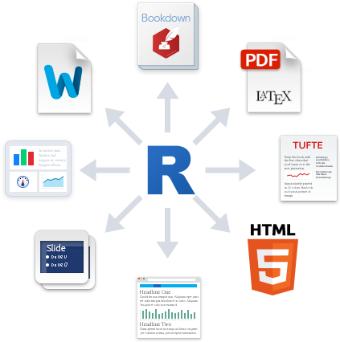

```{r setup, include=FALSE}
knitr::opts_chunk$set(echo = TRUE)
library(knitr)
library(ade4)
library(FactoMineR)
```

```{r logo, echo=FALSE, out.width = '30%', fig.align = "center", fig.cap="Fig. 1: Logo  Rmarkdown"}

```

# Introduction

Bienvenu sous RMarkdown. Vous pouvez ici rédiger du texte avec des polices en *italique*, en **gras**, ou ***les deux***. Vous pouvez inserer des citations comme ceci [@wynes2017climate], comme cela [blabla, ex : @stern2017limiting; et blabla, ex : @lacroix2018comparing] ou encore comme ceci @gerlagh2018family. Veillez à bien gérer votre bibliographie en .bib et vos appels à citation. Vous pouvez utiliser des liens dans le texte comme ceci <https://isaranet.fr/> ou encore utiliser un lien hypertexte comme [**cela**](https://isaranet.fr/). Vous pouvez faire des listes à tiroir (en sautant bien une ligne avant de commencer) :

-   Liste 1
    -   Sous-liste 1.1
    -   Sous-liste 1.2
        -   Ainsi de suite
-   Liste 2

Le sommaire sera géré automatiquement grace au bon usage des \# avant le titre de la partie (ou \## ou \### suivant le niveau du titre).

# Les données

Les données proviennent de ...

## Imports

RMarkdown permet également d'intégrer directement des codes et sorties de R dans le rapport. Pour cela vous devez ouvrir un *chunk* avec une ligne comme ```` ```{r imports, echo=TRUE,eval=TRUE} ```` puis le fermer avec ```` ``` ````. **Chaque *chunk*** doit avoir un nom différent !. Vous pouvez choisir d'afficher le code ou non avec `echo=` et choisir d'exécuter ce code avec `eval=` (en général `TRUE`).

```{r imports, echo=TRUE, eval=TRUE}
phos <- read.table("phosphates.csv", header = TRUE, sep=";", row.names = 1)
```

## Présentation

Nous disposons de données sur ... :

```{r sites, echo=TRUE, eval=TRUE}
head(phos)
```

Vous pouvez aussi intégrer du R dans le texte comme dans la phrase suivante. Nous disposons de `r ncol(phos)` exportateurs et `r nrow(phos)` importateurs.

# Analyses

## Analyses préliminaires

Vous pouvez insérer dans le début du *chunk* des options pour gérer les figures comme `fig.height =`, `fig.width =` , `fig.align =` ou `fig.cap=` (pour la légende).

```{r graph1, echo=TRUE, eval=TRUE, fig.height = 10, fig.width = 6, fig.align = "center", fig.cap="Fig 2: Barplot"}

import <- apply(phos, 1, sum)
export <- apply(phos, 2, sum)
par(mfrow = c(2, 1), mar = c(4, 4, 2, 2))
barplot(sort(import),
  horiz = TRUE,
  las = 2,
  col = "slateblue")
barplot(sort(export),
        horiz = TRUE,
        las = 2,
        col = "red3")

```

Bla bla bla

## Analyses multivariées

### Choix des axes

```{r afc1, echo=TRUE, eval=TRUE, fig.height = 4, fig.width = 4, fig.align = "center", fig.cap="Fig 3 : Intertie"}
caphos <- CA(phos, graph=FALSE)
## Valeurs propres
barplot(caphos$eig[,2], names.arg = paste("Fac",1:7), las=2 )
```

L'axe 1 explique `r round(caphos$eig[1,2],2)`% de l'inertie et l'axe 2 en explique `r round(caphos$eig[2,2],2)`%.

### Axes et Graphiques

```{r afc2, echo=TRUE, eval=TRUE, fig.height = 8, fig.width = 8, fig.align = "center", fig.cap="Fig 4 : Axes"}
plot.CA(caphos)
ctrc <- caphos$col$contrib
ctrl <- caphos$row$contrib
```

## Classification

```{r arbre, echo=TRUE, eval=TRUE, fig.height = 4, fig.width = 4, fig.align = "center",fig.cap="Fig 5: Arbre"}
cahp <- HCPC(caphos, graph=FALSE)
plot.HCPC(cahp, choice="tree")
```

Commentaire :

```{r groupes, echo=TRUE,eval=TRUE}

lapply(cahp$desc.var, function(x) return(x[x[, 6]>0, ]))
```

Nous pouvons identifier 3 groupes :

| Numéro | Nom  | Caractéristiques                            |
|--------|------|---------------------------------------------|
| 1      | Nom1 | Bla Bla Bla Bla Bla Bla Bla Bla Bla Bla Bla |
| 2      | Nom2 | Bla                                         |
| 3      | Nom3 | Bla                                         |

# Interpretations et Conclusion

A vous de jouer...

# Références

## Liens

ISARA : <https://isaranet.fr/> consulté le ...

## Bibliographie

Liste des publications :
